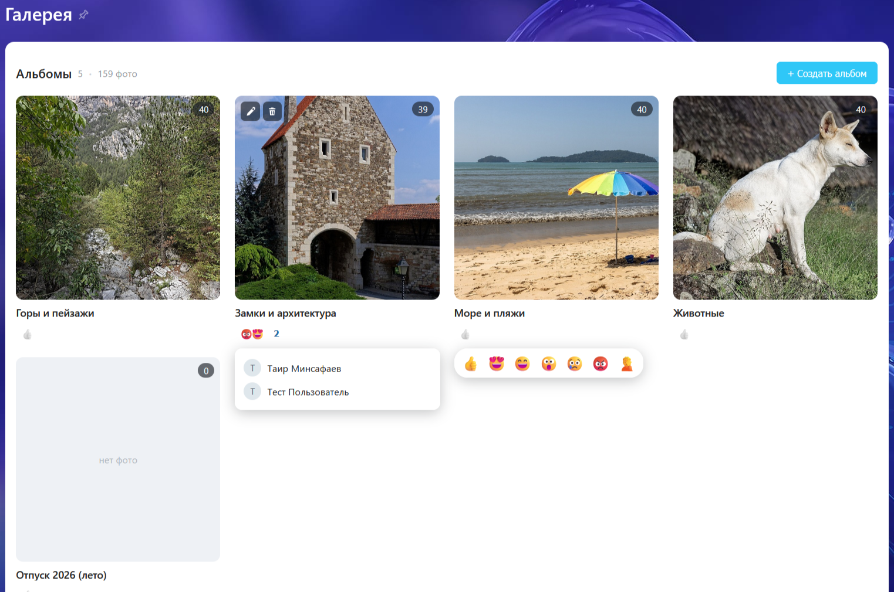
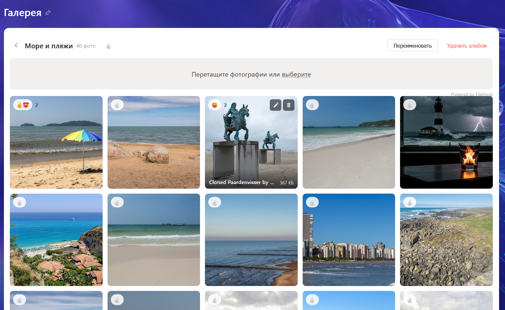

# mtai.gallery — фотогалерея для Bitrix24

Модуль фотогалереи на инфоблоке **с расширенным управлением правами**
(`RIGHTS_MODE=E`): разделы инфоблока — альбомы, элементы — фотографии
(файл в `DETAIL_PICTURE`, подпись в `PREVIEW_TEXT`).

Публичная страница **`/gallery/`** — Vue 3 + Vite приложение (сборка на базе
[MTai88/vite](https://github.com/MTai88/vite)):

- сетка альбомов (обложка = первая фотография по ручной сортировке, счётчик);
- сетка фотографий с **автоподрузкой при скролле** (пагинация по offset);
- **ручная сортировка перетаскиванием** (drag & drop): порядок фотографий
  внутри альбома и порядок альбомов сохраняется в SORT инфоблока; новые
  загрузки и альбомы появляются первыми;
- **загрузка через FilePond** (мультизагрузка, превью, EXIF-ориентация) —
  элемент создаётся сразу при выборе файла; в попапе редактирования фото —
  **замена изображения** через FilePond (применяется сразу, права `element_edit`);
- **редактирование изображений** штатным редактором Bitrix24 (PhotoEditorSDK
  из модуля «Сайты»): кадрирование/поворот/фильтры/стикеры/текст; кнопка в
  попапе редактирования фото, результат сохраняется как замена изображения.
  Требует установленного расширения
  [mtai.image_editor](https://github.com/MTai88/bitrix24_image_editor)
  (`local/js/mtai/image_editor/`) и модуля `landing`; без расширения кнопки
  редактирования просто нет;
- **реакции («лайки») живой ленты** (👍😍😄😮😢😡🤦) на альбомы и фотографии —
  на штатных рейтингах Bitrix24 (как в решении [bitrix24_likes](https://github.com/MTai88/bitrix24_likes)):
  голоса и счётчики в стандартных таблицах, голосование через штатный
  `rating.vote`, список поставивших с аватарами;
- просмотр штатным **просмотрщиком Bitrix24** (`BX.UI.Viewer`, как у полей
  «файл» универсальных списков) — клик по фото, карусель по всем фото сетки;
- редактирование из публички: право определяются правами на инфоблок
  (загрузка, переименование/удаление фото, создание/переименование/удаление
  альбомов) — сервер проверяет каждую операцию через
  `CIBlockRights::UserHasRightTo()`, интерфейс получает гранулярные флаги.

По умолчанию: администраторы (группа 1) — полный доступ (`X`), все
пользователи (группа 2) — чтение (`R`). Дальше права настраиваются в админке
(инфоблок «Галерея», вкладка «Доступ») — публичка и API учитывают их
автоматически, включая права по разделам.

## Скриншоты

Сетка альбомов: обложка из свежей фотографии, счётчик, реакции живой ленты;
пустой альбом помечается заглушкой «нет фото».



Альбом: сетка фотографий с автоподгрузкой при скролле, зона загрузки
FilePond («Перетащите фотографии или выберите»), реакции и счётчик фото.



## Установка

Стенд bitrix24_test:

```bash
docker exec bitrix24_test-php-1 php /var/www/html/local/tools/gallery_install.php install
```

или из админки: `Настройки → Модули → Галерея (mtai.gallery) → Установить`.

Установщик создаёт тип инфоблоков `mtai_gallery`, инфоблок «Галерея» с
расширенными правами, публикует страницу `/gallery/`, копирует компонент
`mtai:gallery.app` в `local/components/mtai/` и собранный клиент в
`/bitrix/js/mtai.gallery/dist/`.

## Сборка клиента

Клиент — Vite-проект в `install/client/` (сборка `dist/` закоммичена,
для установки Node не нужен). Пересборка:

```bash
cd install/client
npm ci
npm run build        # dist/ + manifest.json
# затем переустановить модуль (скопирует свежий dist)
```

Сборка в docker (без локального Node):

```bash
docker run --rm -v "$PWD:/app" -w /app node:22-alpine sh -c "npm ci && npm run build"
```

## Архитектура

```
/gallery/  (install/public/gallery/index.php, шаблон портала)
  └─ mtai:gallery.app  (install/components/mtai/gallery.app)
       ├─ Extension::load('ui.viewer')            — просмотрщик Bitrix24
       ├─ конфиг в data-config (sessid, права, действия ajax)
       └─ /bitrix/js/mtai.gallery/dist/manifest.json → CSS + <script type=module>

Vue (install/client/src/)
  ├─ index.ts — монтирует App в #mtai-gallery-app
  ├─ js/api.ts — клиент ajax-контроллеров + голосование rating.vote
  ├─ js/viewer.ts — BX.UI.Viewer.bind() на корень
  └─ vue/ — App, PhotoGrid, ReactionBar (реакции), Uploader (FilePond),
     InfiniteSentinel, диалоги

AJAX: /bitrix/services/main/ajax.php?action=mtai:gallery.*
  ├─ album.list / album.save / album.reorder / album.delete
  └─ photo.list / photo.upload (FilePond process) / photo.replace
     / photo.reorder / photo.revert / photo.update / photo.delete

Реакции: /bitrix/components/bitrix/rating.vote/vote.ajax.php (штатный) —
  данные (счётчики, моя реакция, подписанный ключ) — в rating полей
  album.list / photo.list; сущности IBLOCK_SECTION / IBLOCK_ELEMENT
```

## Требования

- PHP >= 8.1, модуль `iblock`
- Права на запись в `/local/components/`, `/bitrix/js/`, корень сайта
  (установщик копирует страницу и бандл)

## Лицензия

MIT
